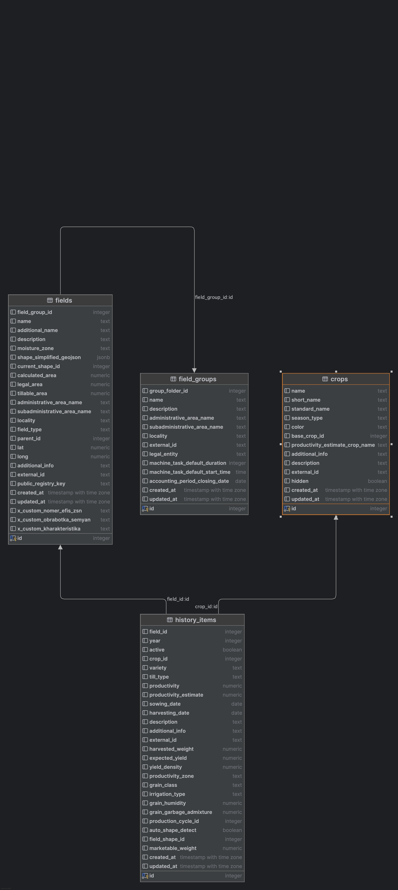

# Документация таблиц

## Версия 0: 4 таблицы

**history_items**

Записывает исторические данные, связанные с полями, культурами и производственными
циклами. Включает информацию о посеве, сборе урожая, производительности, орошении,
качестве зерна и определении формы поля. Содержит метаданные, такие как внешние
идентификаторы, временные метки и описания.

**fields**
Представляет собой земельные участки, на которых выращиваются культуры. Поля относятся к
группам полей и имеют формы, исторические элементы, отчеты разведки и агрооперации.
Атрибуты включают имя, площадь, местоположение, зону влажности и внешние идентификаторы.

**crops**
Определяет типы культур с такими атрибутами, как имя, тип сезона (весна/зима), оценки
производительности и цвет. Культуры связаны с элементами истории, полями, семенами и
задачами машин. Включает предопределенные стандартные названия культур.

**field_groups**

Эта таблица описывает объект **field_groups**, который используется для представления
группы полей. Таблица содержит атрибуты, необходимые для идентификации, описания,
локализации и управления настройками группы. Таблица содержит все необходимые данные
для детального описания и управления группами полей, охватывая как их идентификацию и
описание, так и параметры, связанные с операционной и юридической стороной работы.

## Модель данных

Текущий скрипт для создания схемы можно найти в файле [schema](attachments/schema.sql)