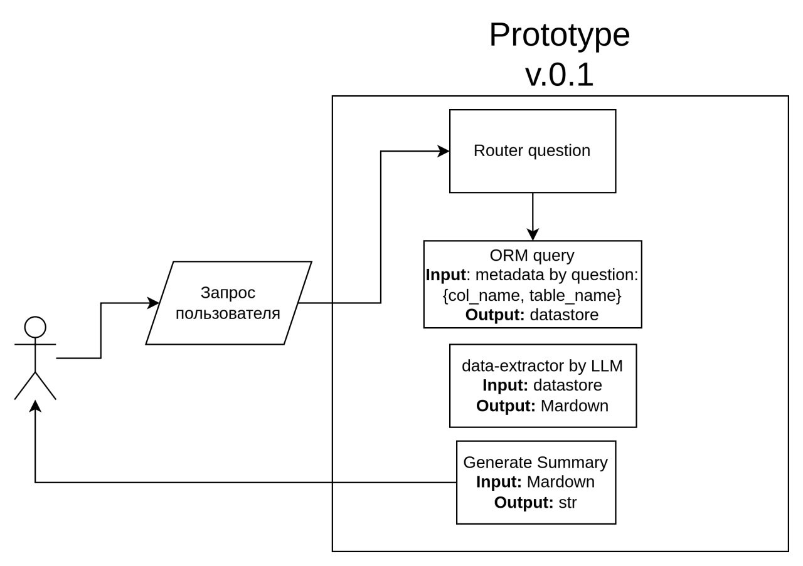
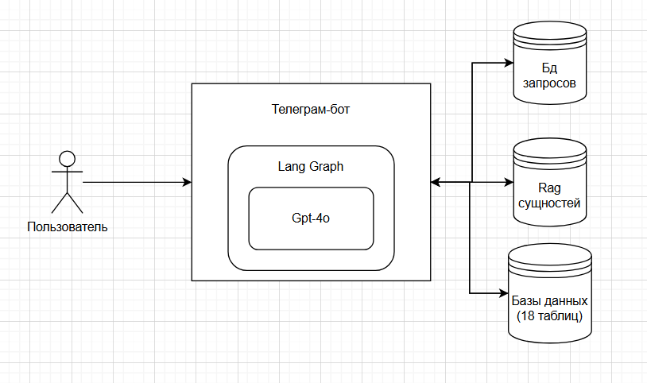
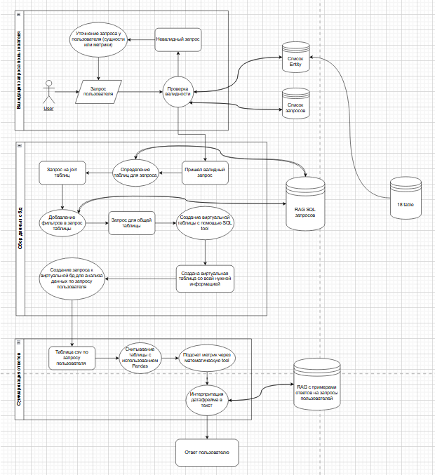

# ML System Design Doc - [RU]
## Дизайн агентной системы на основе LLM для предоставления данных о работе агрохолдинга
## 1. Зачем идем в разработку продукта?
### Бизнес-цель

Упростить и ускорить процесс получения аналитической информации для сотрудников агрохолдинга за счёт персонального помощника-бота в Telegram. Цель — сократить время на ручной поиск аграрных показателей, отчётов, сводок и повысить эффективность принятия решений аналитиками.

### Проблематика

- Агрономы, менеджеры и аналитики ежедневно задают похожие вопросы, тратя много времени на ручной поиск информации в корпоративных системах.
- Долгий процесс поиска и отсутствие хорошей системы поиска внутри телеграмма.

### Преимущества использования ML

1. Семантический поиск и извлечение: Модель может понимать смысл запроса и находить ответы в текстах (документы об урожайности, отчёты о погоде и т.д.).
2. Автоматизация рутинных операций: Бот быстро выдаёт результаты по запросам, позволяя аналитикам сосредоточиться на более важных задачах.
3. Обработка естественного языка: Система поддерживает живой диалог на русском языке, что упрощает использование сотрудниками без технической подготовки.


### Критерии успеха:

Интеграция бота в активные телеграм-каналы и обеспечение пользователей ответами на вопросы с помощью бота.
Пользователи находят ответы на свои вопросы в нашем телеграм боте.

### Пользовательские потребности (исходя из USM и CJM)

- Уровень вовлечённости: Увеличение доли сотрудников, которые регулярно используют бота для поиска ответов.
- Уменьшение количества повторных вопросов, загружающих поддержку, и предоставление 
пользователю возможности самостоятельного поиска нужной информации.
- Снижение времени реакции: Уменьшение времени получения актуальных агроданных.

### Ожидаемый пользовательский опыт

- Аналитики: Хотят оперативно получать сводные данные (урожайность, склады, логистика) для принятия быстрых решений.
- Возможность задать вопрос на естественном языке и сразу получить конкретный ответ — даже на смартфоне через Telegram.

## 2. Бизнес-требования и ограничения
### Краткое описание бизнес требований

- Разработка интуитивно понятного интерфейса для задавания вопросов в чате.
- Данные: Таблицы с урожайностью, геолокациями, отчетами о продажах, а также исторические показатели.
- ML-инфраструктура: Использование LangGraph-агентов, RAG-логики для поиска данных и их суммаризации в реальном времени.

### Итерации проекта 

**Первая итерация:**
Прототипирование основного функционала для демонстрации возможности системы. Процесс будет выстроен для тринадцати вопросов и 4-х таблиц.
**Вторая итерация:**
Разработка Телеграмм-бота, который должен уметь отвечать на релевантные вопросы в формате естественного текста по имеющейся базе знаний.
**Третья итерация:**
Добавить учет всех представленных вопросов, а также взаимодействие со всеми таблицами.

### Критерии успеха и возможные пути развития проекта
Снижение числа повторных вопросов и повышение качества ответов.
Развитие: расширение функциональности, поддержка новых платформ, улучшение алгоритмов.

## 3. Что входит в скоуп проекта/итерации, что не входит
### Какие БТ будут покрыты с технической точки зрения за первую итерацию:
- Интеграция с API для анализа и классификации запросов пользователей на естественном языке.
- Реализация базы данных для хранения и извлечения данных с использованием PostgreSQL.
- Разработка и тестирование алгоритма поиска для эффективного нахождения релевантных ответов.
### Что не будет закрыто:
- Итерационная оптимизация производительности: начальные версии могут не поддерживать полный объем запросов.
- Неполная обработка вопросов.
- Отсутствие поддержки всех таблиц.
### Какие БТ будут покрыты с технической точки зрения за вторую итерацию:
 - Создание диалоговой системы, чат-бота в телеграмм.
 - Ассинхронность запросов.
### Какие БТ будут покрыты с технической точки зрения за третью итерацию:
- Обработка всех предоставленных вопросов.
- Взаимодействие со всеми таблицами в БД.
- Возможность добавлять новые вопросы.

## Архитектура первого прототипа

Для проверки работоспособности идеи мы пришли к следующей архитектуры системы. На вход
мы принимаем один из 13 вопросов из тестового набора. Для прототипа мы приняли решение
считать, что входной вопрос валиден и достаточен. 

Далее мы проводим семантическое сопоставление с вопросами из тестовой выборки и получаем "
ключ" вопроса. Это представление не зависит от текста вопроса и уникально идентифицирует
вопрос среди всех доступных. Эта архитектура не предполагает ответы на неизвестные
вопросы.  

По ключу мы получаем список параметров, необходимых для ответа на вопрос и извлекаем 
эти сущности из текста вопроса. 

В рамках прототипа мы решили реализовать негибкую систему. Мы заранее создаем 
параметризованные функции, к которым мы можем обратиться. Так мы получим неглубокую 
таблицу, на который были проведены все трансформации и она готова для передачи в 
контекст llm для суммаризации в естественный язык.
Таким образом, в конце работы системы следующее состояние:

```json
{
  "original_question": "Какой гибрид пшеницы показал наибольшую урожайность в сезоне 2024?",
  "question_key": 2,
  "template_question": "Какой гибрид $crop_name$ показал наибольшую урожайность в сезоне $year$?",
  "extracted_parameters": {
    "crop_name": "пшеницы",
    "year": "2024"
  },
  "data_store_name": "crop_yield_statistics",
  "data_store_sql": "SELECT hi.variety, hi.productivity FROM history_items AS hi JOIN crops AS c ON hi.crop_id = c.id WHERE hi.year = 2024 AND c.name ILIKE '%пшеница%' AND hi.productivity IS NOT NULL",
  "analysis_query": "SELECT variety, productivity from crop_yield_statistics ORDER BY hi.productivity DESC LIMIT 1;",
  "natural_language_response": "Гибрид пшеницы с максимальной урожайностью в сезоне: 2024: Гибрид: Алексеич, Урожайность: 52.5 ц/га"
}
```

**Диаграмма архитектуры**



## Роли в команде
- Максим Коновалов - Агент для валидации запроса пользователя и поиска сущностей в запросе.
- Максим Бутаков - Предобработка данных.
- Ильяс Галиев - Создание архитектуры.
- Чернятов Адель - Реализация графовой архитектуры.
- Александр Самсонов - backend, инфрастуктура.

## Архитектура проекта: Анализ пользовательских запросов с LLM и LangGraph

## 1. Общий обзор

Этот проект представляет собой систему анализа данных, основанную на обработке текстовых
запросов пользователей с использованием **LLM (GPT-4o)** и **LangGraph**. Система
позволяет пользователям формулировать аналитические запросы, автоматически извлекать
данные из базы, анализировать их и предоставлять интерпретированные результаты в удобном
виде.

### Основные функции:

- Обработка пользовательского запроса
- Определение нужных данных и генерация таблицы из SQL-запроса
- Выполнение запроса к базе данных
- Анализ результатов с помощью Repl tool
- Генерация текста-ответа с интерпретацией данных с помощью LLM

### Ключевые технологии:

- **Язык программирования:** Python
- **LLM API:** OpenAI GPT-4o
- **Фреймворк обработки данных:** SQL + Repl tool
- **База данных:** PostgreSQL
- **Обработка естественного языка:** SpaCy
- **Формирование SQL-запросов:** RAG

---

## 2. Архитектурная диаграмма



1. Пользовательский ввод

- Источник данных: Пользователь
- Вводит текстовый запрос в систему (например: "Средняя выручка за февраль")

2. Обработка запроса

- NLP-модуль (обработчик текста)
- Извлекает ключевые сущности (например, "выручка", "февраль")
- Определяет тип запроса (например, аналитический запрос)
- Если запрос невалиден – отправляет уточняющий вопрос пользователю

3. Генерация SQL-запроса

- На основе выделенных сущностей и типа запроса
- Определяются нужные таблицы в базе данных
- Генерируется SQL-запрос
- Выполняет SQL-запрос
- Возвращает результаты в виде таблицы

4. Repl (Oбработкa данных)

- Получает данные из базы
- Формирует данные для анализа
- Передаёт данные в LLM для интерпретации

6. LLM (GPT-4o)

- Анализирует полученные данные
- Генерирует объяснение на естественном языке
- Формирует вывод в нужном формате через пример.

7. Вывод пользователю

- Интерпретация результатов
- Отправка пользователю итогового отчёта

---

## 3. Потоки данных (Data Flow)



### Основные этапы обработки:

1. Пользователь вводит запрос в текстовом виде.
2. Валидация и обработка запроса – проверяется корректность, выделяются ключевые сущности.
3. Определение нужных данных – анализируется, из каких таблиц необходимо получить данные.
4. Генерация SQL-запроса – создаётся SQL с необходимыми фильтрами.
5. Поиск данных в базе – запрос выполняется, создаётся виртуальная таблица.
6. LLM анализирует данные – данные обрабатываются, формируется аналитика.
7. Генерация итогового ответа – система формирует интерпретацию результата в текстовом
   виде.
8. Отправка ответа пользователю в виде текста и таблицы.

---

### Возможные улучшения:

- Поддержка сложных SQL-запросов.
- Гибкое кэширование часто используемых запросов.
- Визуализация данных (графики, таблицы, дашборды).

---

## Итог

Эта архитектура позволяет пользователям анализировать данные с помощью **LLM и LangGraph
**, автоматически формируя SQL-запросы, выполняя их в базе данных и интерпретируя
результаты. Гибкая модульная структура делает систему масштабируемой и адаптируемой под
разные сценарии.
